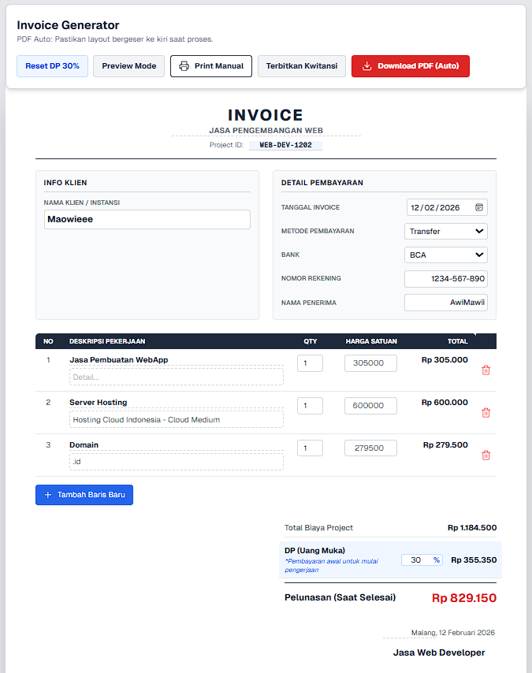
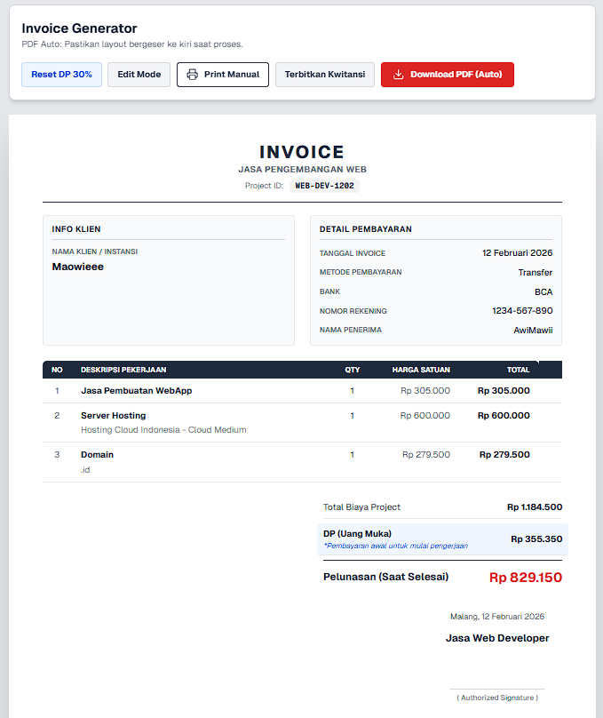
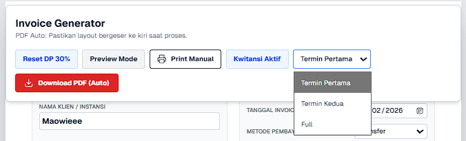
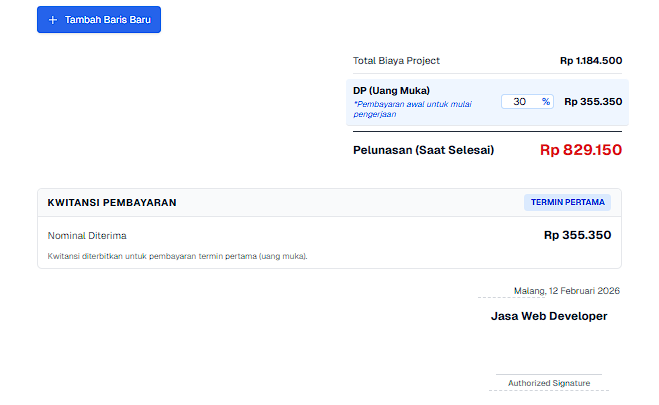
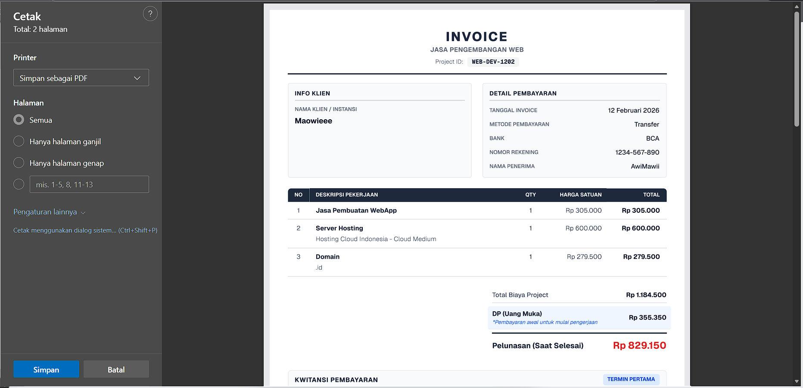

# Invoice Generator

Aplikasi web untuk membuat invoice jasa/proyek dengan mode edit interaktif, export PDF otomatis, print manual, dan dukungan penerbitan kwitansi pembayaran (termin/full).

## Ringkasan

Project ini dibangun menggunakan Next.js App Router dan TypeScript. Fokus utamanya adalah mempercepat pembuatan invoice berformat A4 portrait yang siap dibagikan ke klien dalam bentuk PDF.

Fitur utama:

- Edit invoice langsung di halaman (WYSIWYG).
- Toggle `Edit Mode` dan `Preview Mode`.
- Export PDF otomatis menggunakan `html2pdf` (CDN).
- Opsi `Print Manual` sebagai fallback.
- Dukungan status kwitansi: `Termin Pertama`, `Termin Kedua`, `Full`.
- Dropdown bank otomatis muncul saat metode pembayaran `Transfer`.
- Layout dipadatkan agar lebih aman terhadap batas tinggi 1 halaman A4 portrait.

## Preview Generator











## Stack Teknologi

- `Next.js 16`
- `React 19`
- `TypeScript`
- `Tailwind CSS 4`
- `lucide-react` untuk ikon
- `html2pdf` (runtime CDN) untuk generate PDF

## Struktur Folder Inti

```text
src/
  app/
    page.tsx                    -> Halaman utama (render InvoiceGenerator)
    invoice/page.tsx            -> Route tambahan /invoice
  components/invoice/
    InvoiceGenerator.tsx        -> Orkestrasi state + render seluruh section
    Toolbar.tsx                 -> Kontrol mode, kwitansi, print, export
    InvoiceHeader.tsx           -> Header invoice (title, tagline, project ID)
    InfoSection.tsx             -> Data klien, pembayaran, bank/rekening
    ItemsTable.tsx              -> Tabel item jasa/produk
    TotalsSection.tsx           -> Subtotal, DP, pelunasan
    ReceiptSection.tsx          -> Ringkasan kwitansi pembayaran
    InvoiceFooter.tsx           -> Tanda tangan dan lokasi/tanggal
    constants.ts                -> Initial state dan opsi dropdown
    types.ts                    -> Type model invoice
    utils.ts                    -> Helper kalkulasi & format
```

## Data Model Invoice

Beberapa field penting di `src/components/invoice/types.ts`:

- Identitas invoice: `orderId`, `invoiceTagline`, `date`, `location`.
- Penjual/klien: `sellerName`, `buyerName`, `signatureLabel`.
- Pembayaran: `paymentMethod`, `bankName`, `accountNumber`, `recipientName`.
- Kwitansi: `showReceipt`, `receiptStatus`.
- Nilai transaksi: `items`, `dpValue`, `currency`.

## Menjalankan Project

Prasyarat:

- Node.js LTS (disarankan versi modern, minimal setara ekosistem Next.js terbaru).
- npm.

Instalasi:

```bash
npm install
```

Jalankan mode development:

```bash
npm run dev
```

Buka di browser:

- `http://localhost:3000`
- `http://localhost:3000/invoice`

## NPM Scripts

- `npm run dev` menjalankan server development.
- `npm run build` build production.
- `npm run start` menjalankan hasil build production.
- `npm run lint` menjalankan ESLint.

## Alur Penggunaan

1. Isi data invoice di `Edit Mode`.
2. Tambah/ubah item pekerjaan pada tabel.
3. Atur DP sesuai kebutuhan.
4. Aktifkan kwitansi dari toolbar jika diperlukan.
5. Pilih status kwitansi (`Termin Pertama`, `Termin Kedua`, `Full`).
6. Cek hasil di `Preview Mode`.
7. Export via `Download PDF (Auto)` atau gunakan `Print Manual`.

## Catatan PDF dan A4

- Layout invoice sudah diset untuk `A4 portrait` pada mode print/export.
- `InvoiceGenerator` menggunakan sinkronisasi style komputasi untuk menjaga konsistensi warna saat export PDF.
- Jika library PDF belum siap/gagal, sistem menyediakan fallback ke print manual browser.

## Kustomisasi Cepat

Ubah nilai default invoice:

- `src/components/invoice/constants.ts`

Tambah opsi metode pembayaran/bank/status kwitansi:

- `src/components/invoice/constants.ts`
- `src/components/invoice/types.ts`

Ubah tampilan section:

- `src/components/invoice/*.tsx`

## Catatan Operasional

- Export PDF otomatis membutuhkan akses untuk memuat script `html2pdf` dari CDN.
- Untuk pipeline CI/CD, pastikan environment build kompatibel dengan versi Next.js dan React yang digunakan project ini.
